# Skill Graph

Which skills reference which. Generated by `scripts/skill-graph`;
do not edit by hand.

57 skills, 133 references. Solid arrows stay
inside a category; dotted arrows cross category boundaries. Each
diagram shows every edge touching its category.

## agent

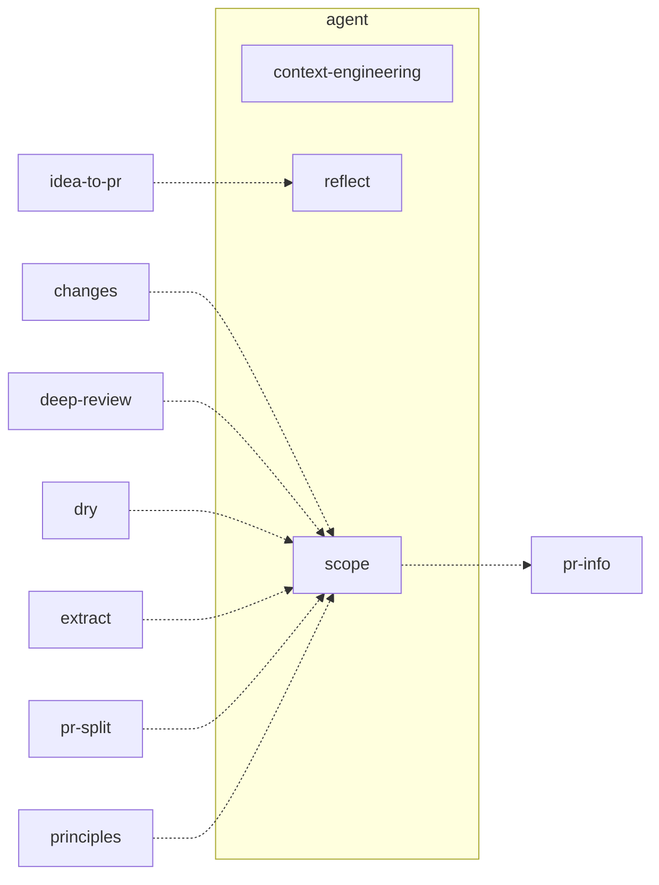

## code-quality

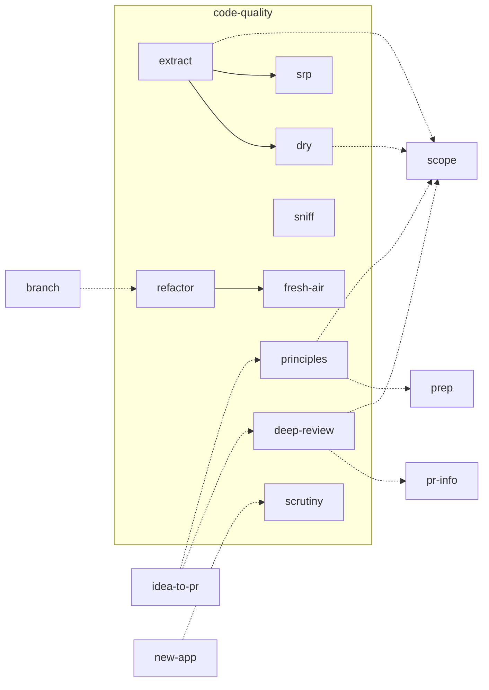

## dev

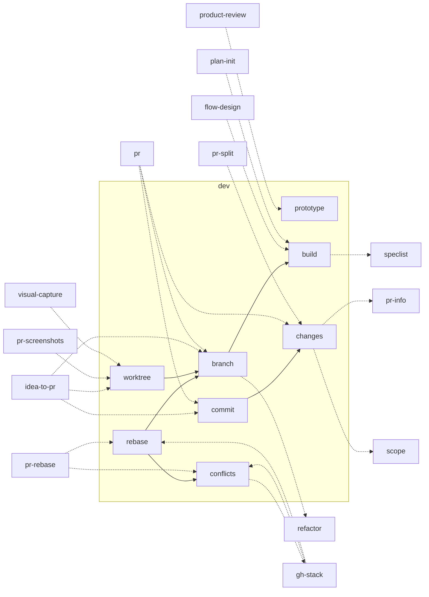

## env

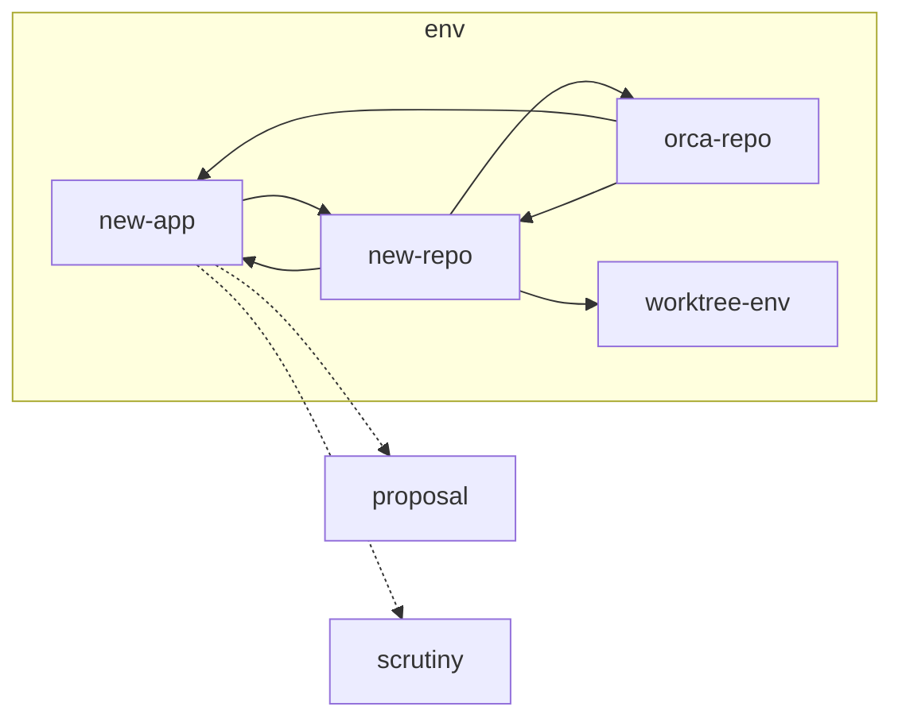

## issues

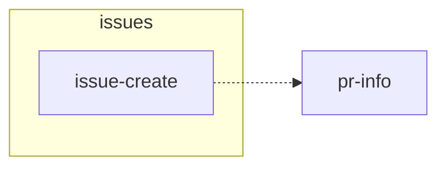

## planning

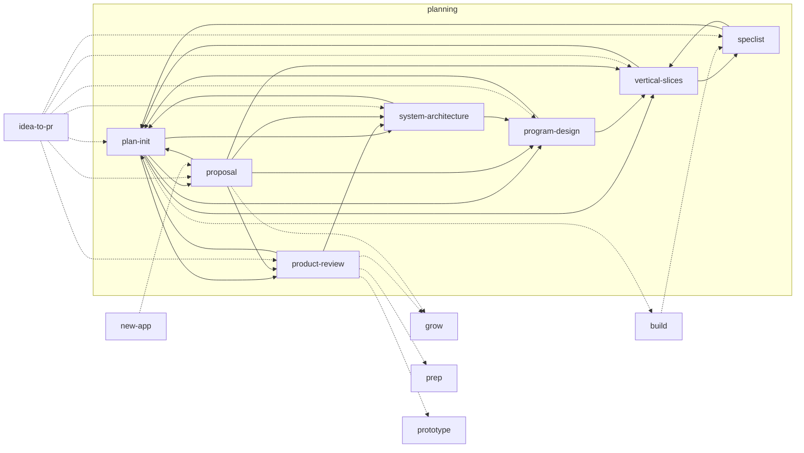

## pull-requests

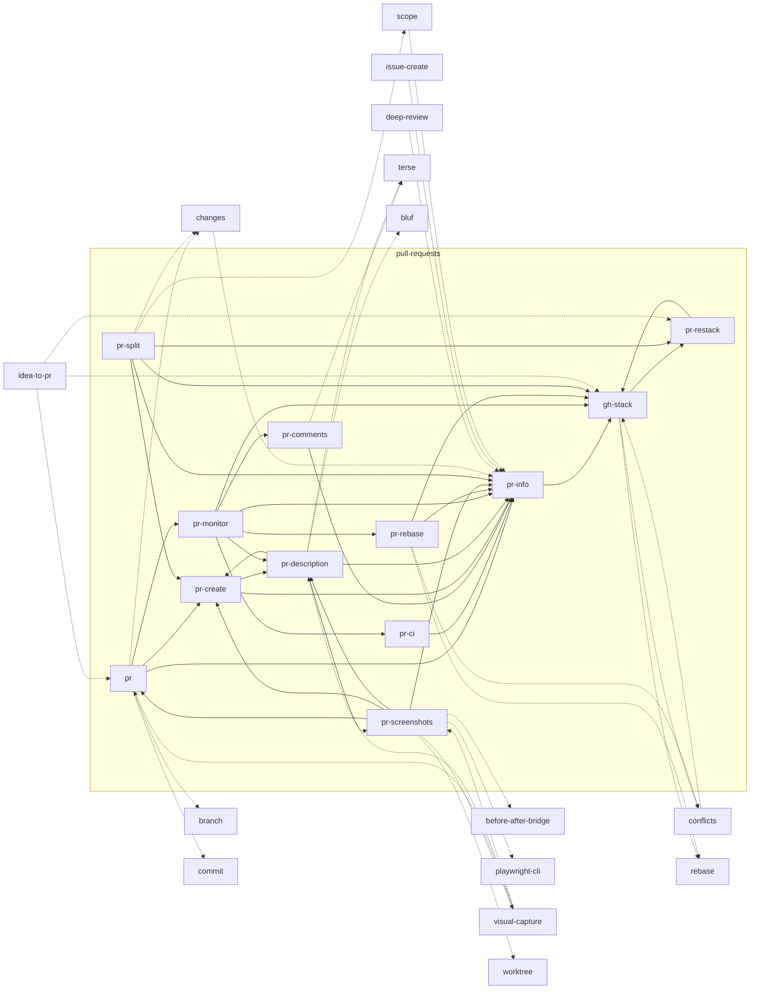

## tools

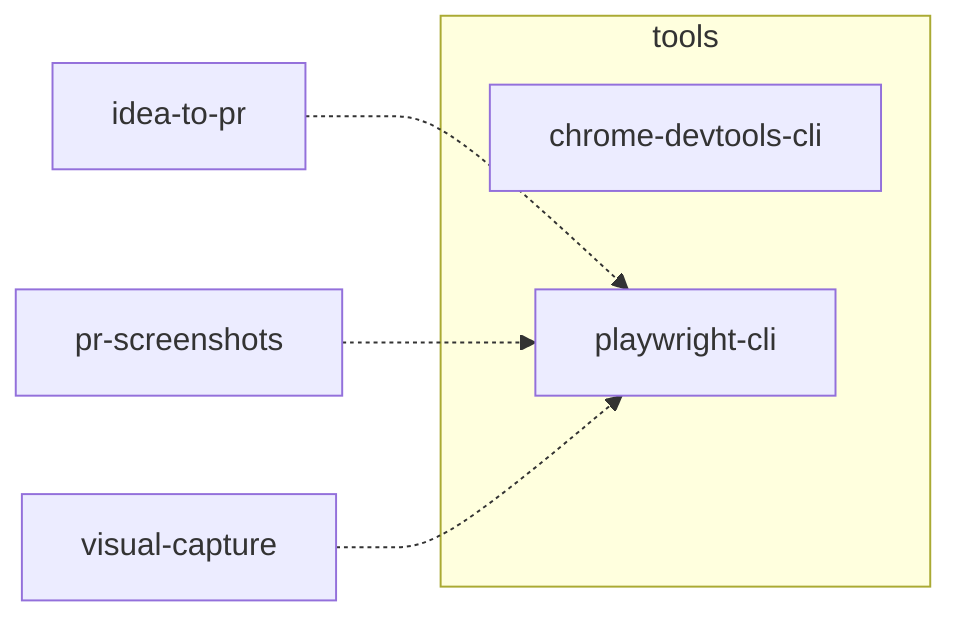

## visual

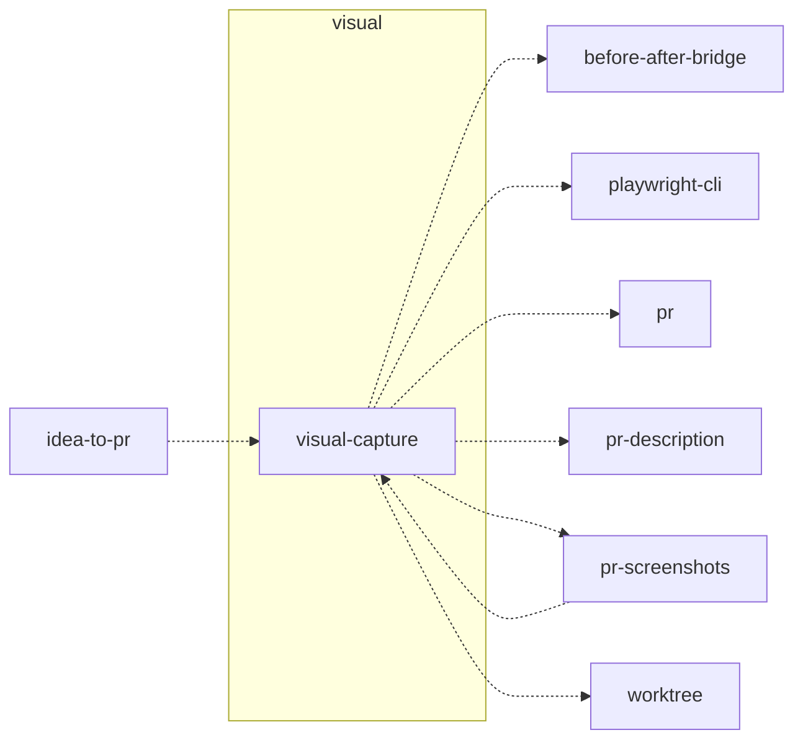

## workflow

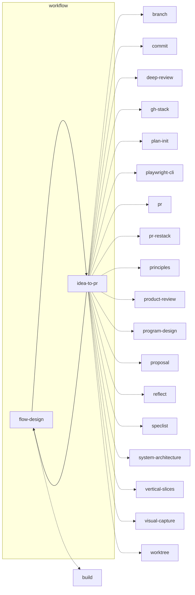

## writing

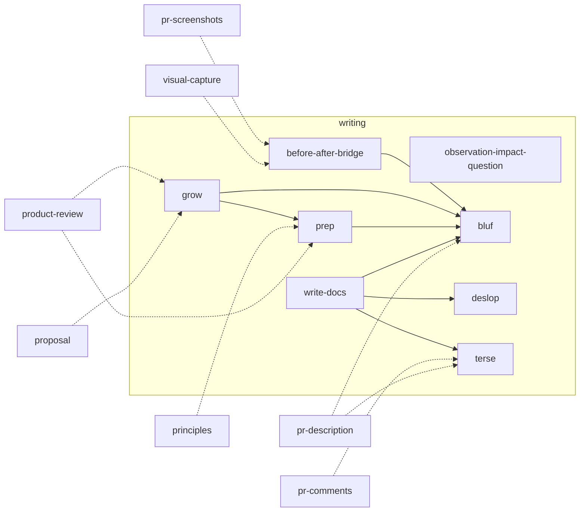
